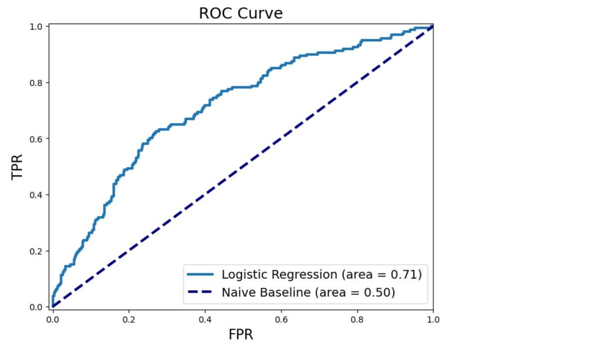

# Framingham Heart Study Analysis

## Introduction

The Framingham Heart Study is a long-term, ongoing cardiovascular cohort study of residents of the Framingham, Massachusetts. This project aims to analyze data from the study to predict the risk of Coronary Heart Disease (CHD) within the next 10 years using logistic regression. By identifying significant risk factors, we can develop a model to assist in making informed decisions about preventive medication.

## Data Preparation

The dataset consists of various health and demographic variables collected from the participants. The data is split into a training set (`framingham_train.csv`) and a test set (`framingham_test.csv`). The training set contains 2560 data points, while the test set contains 1098 data points.

## Logistic Regression Model

### Model Building

Using the training dataset, we built a logistic regression model to predict the probability of CHD within the next 10 years. The following independent variables were used:

- Gender (male)
- Age
- Education level
- Smoking status and cigarettes per day
- Blood pressure medication usage (BPMeds)
- History of stroke (prevalentStroke)
- Hypertension (prevalentHyp)
- Diabetes
- Total cholesterol (totChol)
- Systolic blood pressure (sysBP)
- Diastolic blood pressure (diaBP)
- Body Mass Index (BMI)
- Heart rate
- Blood glucose level

The logistic regression equation used by the model is:

y = 1 / (1 + e^{-(beta_0 + beta_1X_1 + beta_2X_2 + ... + beta_17X_17)

Where y is the probability of experiencing CHD, and the coefficients beta_0, beta_1, ..., beta_17 represent the weights of the corresponding variables.

### Significant Risk Factors

The model identified the following significant risk factors for 10-year CHD risk:

- Age (0.0711)
- Male gender (0.4217)
- Number of cigarettes smoked per day (0.0250)
- Total cholesterol (0.0028)
- Systolic blood pressure (0.0092)
- Blood glucose level (0.0082)

### Model Interpretation

- **Age**: For each additional year, the odds of developing CHD increase by approximately 7.1%.
- **Male gender**: Males have higher odds of developing CHD compared to females.
- **Cigarettes per day**: Each additional cigarette per day increases the odds of CHD.
- **Total cholesterol**: Higher cholesterol levels are associated with increased CHD risk.
- **Systolic blood pressure**: Higher systolic BP is linked to higher CHD risk.
- **Blood glucose level**: Elevated glucose levels increase the risk of CHD.

## Optimal Medication Strategy

### Threshold for Prescribing Medication

To determine the optimal strategy for prescribing medication, we calculated a threshold value p such that medication should be prescribed if the predicted CHD risk exceeds p. The calculated threshold was p = 0.1307.

### Model Performance on Test Set

Using the threshold p = 0.1307, we evaluated the model's performance on the test set:

- **Accuracy**: 0.6202
- **True Positive Rate (TPR)**: 0.7063
- **False Positive Rate (FPR)**: 0.3945

### Expected Economic Cost

The expected economic cost per patient, considering the treatment decision, was estimated to be $96,407.

## ROC Curve Analysis

The ROC curve provides valuable insights into the model's performance and helps decision-makers select optimal thresholds for prescribing medication.



The ROC curve provides valuable information to decision-makers:

- **Model Performance Evaluation**:
Decision-makers can visually assess how well the logistic regression model discriminates between positive and negative cases of CHD. A model with a higher area under the ROC curve (AUC) generally indicates better discrimination ability.
- **Threshold Selection**:
Decision-makers can use the ROC curve to select an optimal threshold value based on their preferences for true positive rate (sensitivity) and the false positive rate (1 - specificity).
- **Comparative Analysis**:
Decision-makers can compare the performance of the logistic regression model with other predictive models or medications for preventing CHD. By plotting multiple ROC curves on the same graph, they can visually compare the discrimination abilities of different models or treatments.

## Ethical Considerations

Ethical concerns in this analysis include the potential for bias and overmedication. To address these concerns, the analysis can incorporate additional criteria and involve diverse stakeholders in the decision-making process.

## Conclusion

The logistic regression model provides a useful tool for predicting the 10-year CHD risk and assisting in medication decisions. By carefully considering significant risk factors and ethical implications, healthcare providers can make informed decisions to improve patient outcomes.

For more details refer to [IEOR - Framinghan Heart Study](IEOR - Framinghan Heart Study.ipynb)

## Appendix

### Code for Logistic Regression Model

```python
import numpy as np
import pandas as pd
import statsmodels.formula.api as smf

# Load training data
train_data = pd.read_csv("framingham_train_sp24.csv")

# Model Fitting (Logistic Regression)
logreg = smf.logit(formula='TenYearCHD ~ male + age + education + currentSmoker + cigsPerDay'
                   '+ BPMeds + prevalentStroke + prevalentHyp + diabetes + totChol + sysBP'
                   '+ diaBP + BMI + heartRate + glucose',
                   data=train_data).fit()

print(logreg.summary())
